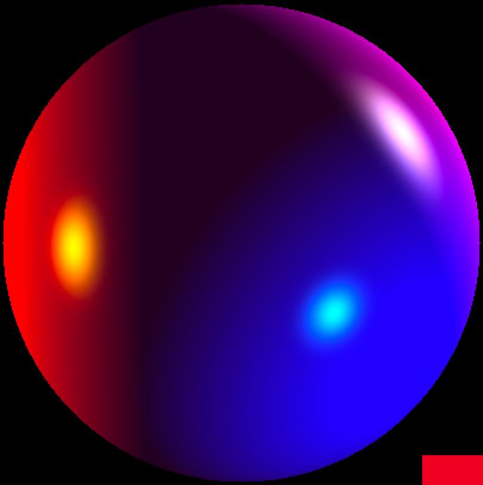

# Ray tracing

## Installation and Run.

This project utilizes the SFML library.

```

    git clone https://github.com/d3clane/raytracing
    
    make

 ```

## About project

This project simulates a multi-colored sphere realistic in all attributes and has a mesmerising visual effect. The amazing feature of the sphere is that it has its own color alongside reflecting color from the various light sources. The use of physics ensures that the sphere color is determined on every frame of the run making the visuals even more smooth and realistic.



- **Physics Based Color Calculation**: The sphere combines the two approaches to light and color: it has a base shading for its material and its own lights, which contribute to the color on every frame.

- **Moving Control**: The pretty sphere can be freely moved in the scene through intuitive buttons controls. 

- **Buttons Implementation**: Buttons are controlled by a `Button Manager`. Each button is implemented using `command pattern`. Each of the buttons also have hovering continuous animations (they gradually turn red when are hovered by mouse).

- **Colored Light Sources**: The sphere acts with realism to more than one colored bulb, each engaging to the display with the sphere.
